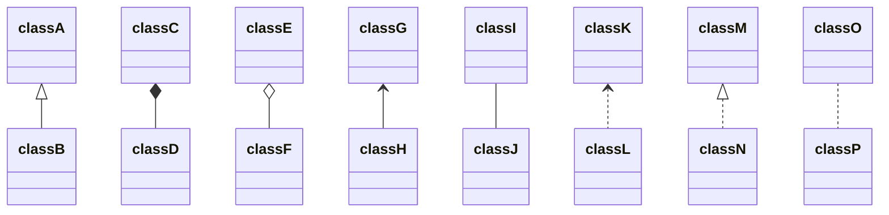
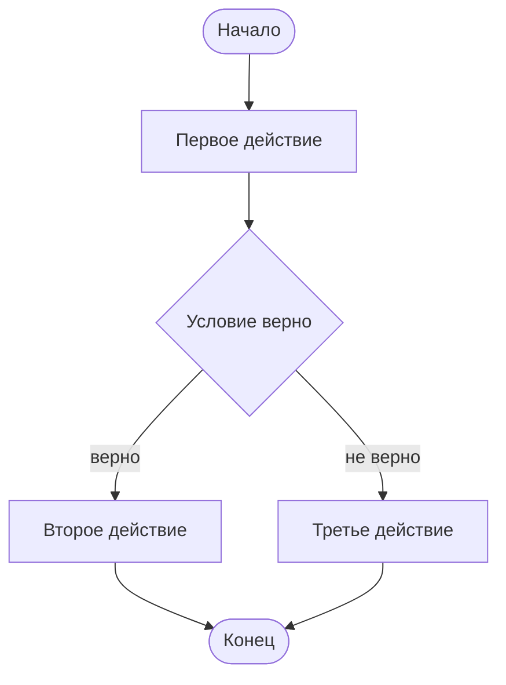
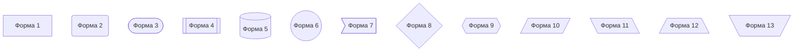

[Mermaid live editor(Realy good)](https://mermaid.live/edit#pako:eNp9kbFOwzAQhl_FctdUKm1ZPCDRpmxMMJEwWIlDoyZx5bgqVVOJdoCFiREJIcELVIhIIESe4fxGXJpEdEB48d1_3_l--ZbUk76gjAaRnHtjrjQ5t93ETQieYweeYGvuYAtfUFxW4sCBZ8jNDbxBATmBd8jh06zNBoUPyGtquIRXsy7bKpngVTZ9Q7GqCNuBB2wqUPznnZEDL0jkZmPu_6Zqq6TdPiKD2uIuGdZOyiT7HZ8Re69AMtT23WVkVPvblU8ceER_yJjbxlJVaCaTVC8igQaCMIpYKwi6_U7HSrWSE8FavV6vjtvz0Ndj1p9eW56MpCrRoKn5PMW_V3zByEGXHFKLxkLFPPRxM8tyjkv1WMTCpQxDn6uJS91khRyfaXm2SDzKtJoJi86mPtfCDvmV4jFlAY9SVIUfaqlOq1XvNm7RKU8upGyY1Q9z6d6A)
[Mermaid habr documentation](https://habr.com/ru/articles/652867/)
[StarUML](https://staruml.io/download)
[Draw.io](https://app.diagrams.net/)
[From algorithm to code](http://www.athtek.com/flowchart-to-code.html)
