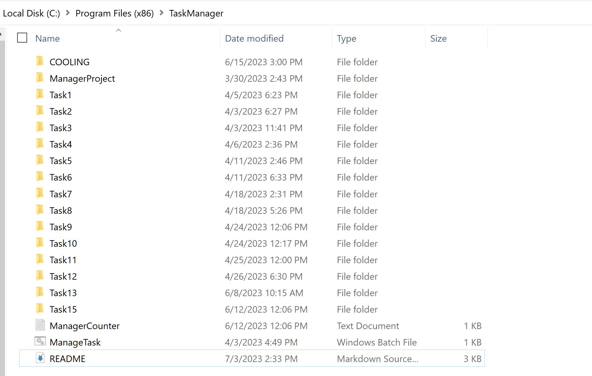
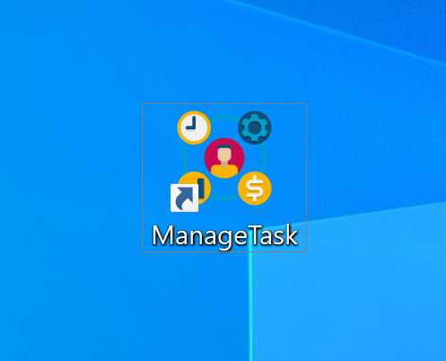
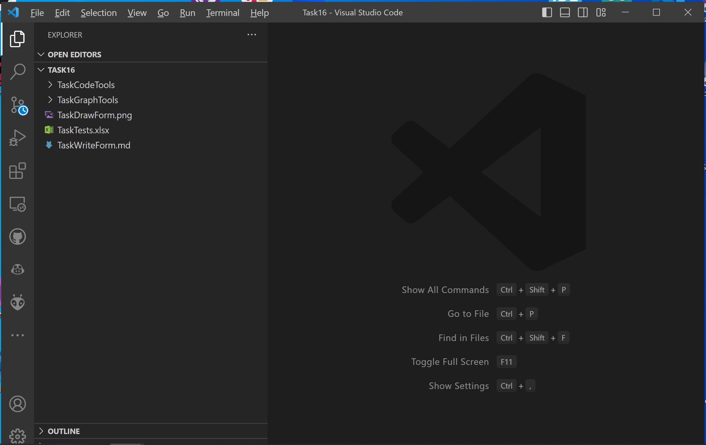
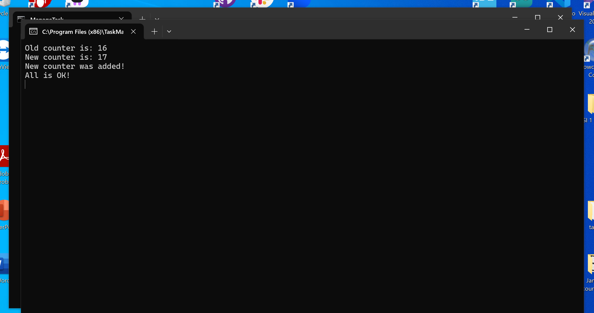

**TaskManager**

TaskManager is a tool designed to automate the creation of new projects(in VS code) based on template files located in the TaskTools folder. This tool greatly simplifies the process of initializing new projects, especially in cases where you frequently need to create projects with a similar structure and files.

**Key Features:**

1. Create New Projects: TaskManager allows you to create new projects using pre-defined template files from the TaskTools folder. This is particularly useful when you need to quickly initialize a project with a specific structure.
2. Project Templates: TaskTools contains pre-prepared template files that can be used to create new projects. These templates may include configuration files (.devcontainer), setup files (Dockerfile, cmake, make), code samples (TaskCode.py), and other resources (solution theory, UML diagrams).
3. Custom Configuration: Users can configure TaskManager to add their own templates to the TaskTools folder or modify existing templates to suit their needs. This makes the tool more flexible and adaptable to various projects.
4. Command-Line Interface: TaskManager provides a command-line interface for easy management of the process of creating new projects. This allows the tool to be used in automated scripts and build processes.

**Technical Details:**

TaskManager is implemented using batch scripts, C++, and CMake. Batch scripts handle various tasks during project creation, C++ provides core logic for file operations and template processing, while CMake handles project configuration and building.

**Installation:**

1. Clone the TaskManager project repository from GitHub.

```
git clone https://github.com/IGORSVOLOHOVS/TaskManager.git
```

2. Navigate to the main project directory:

```
cd ManagerProject
```

3. Create the "Build" directory for project compilation:

```
mkdir Build
cd Build
```

4. Configure the project using CMake:

```
cmake .. & cmake --build .
```

5. Create a text file named "ManagerCounter" with a value of 0 in the root directory:

```
echo 0 > ../../ManagerCounter
```

6. Run the ManagerTask program from the root directory:

```
../../ManageTask
```

Note: Ensure that you have the necessary dependencies and programs installed, such as CMake and a C++ compiler. If there are any errors or issues during installation or build, refer to the project documentation for additional information or support.

**Notes:**
TaskManager is designed to increase efficiency and convenience in creating new projects based on template files. It helps avoid repetitive work when initializing projects and allows you to focus on more critical development tasks. The project can be further enhanced and extended to meet the needs and preferences of users.

**Photo:**

*TaskManager directory with generated projects*


*So, I created a link to the TaskTools batch file and added to desktop...*




