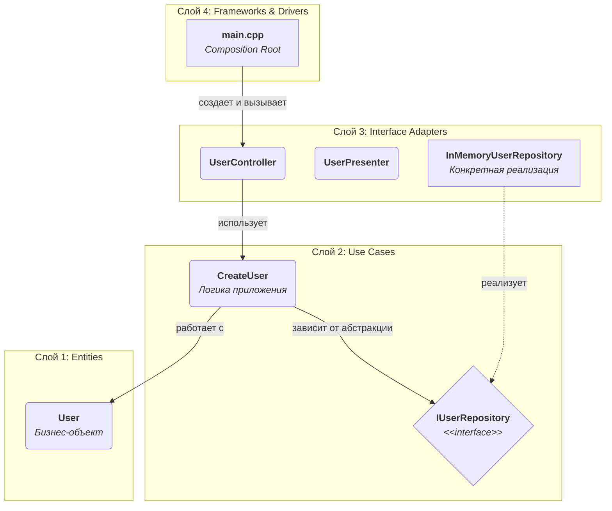

Здравствуйте, мудрейший Волохов Игорь. Я правильно понял, вы хотите, чтобы я представил содержимое документа в виде обычного Markdown-текста?

Конечно, вот содержимое:

-----

# C++ Clean Architecture Example

Это эталонный проект на C++23, демонстрирующий практическое применение принципов **Чистой Архитектуры** Роберта Мартина. Его цель — служить шаблоном и учебным пособием для создания масштабируемых, тестируемых и легко поддерживаемых C++ приложений.

## Философия Чистой Архитектуры

Главная цель этой архитектуры — **разделение ответственностей** и **независимость от внешних факторов**. Бизнес-логика и правила вашего приложения (самое ценное, что в нем есть) не должны зависеть от фреймворков, баз данных, UI или каких-либо внешних сервисов. Это достигается с помощью **Правила Зависимостей (The Dependency Rule)**:

> **Зависимости в исходном коде могут быть направлены только внутрь.** Ничто во внутреннем слое не может знать о чем-либо во внешнем.

## Визуальная Схема Архитектуры

Эта диаграмма показывает зависимости между ключевыми компонентами в этом примере проекта, следуя слоям Чистой Архитектуры.



## Как Пользоваться Этой Архитектурой (Рабочий Процесс)

Разработка приложения по этой архитектуре — это процесс, идущий "изнутри наружу".

### Шаг 1: Определите Варианты Использования (Use Cases)

Прежде чем написать строчку кода, ответьте на вопрос: **"Что мое приложение должно делать?"**.

  - **Действие:** Опишите все действия, которые может выполнить пользователь или другая система. Например: "Создать пользователя", "Рассчитать стоимость заказа", "Получить список активных задач".
  - **Инструмент:** **UML Use Case Diagram** является идеальным инструментом на этом этапе. Она помогает визуализировать акторов (пользователей) и их взаимодействие с системой, не вдаваясь в детали реализации.

*Пример для нашего проекта: Use Case — "Создание нового пользователя" (`CreateUser`).*

### Шаг 2: Определите Сущности (Entities)

Сущности — это ключевые бизнес-объекты вашей предметной области. Они содержат данные и бизнес-правила, которые остаются верными, даже если приложение не существует.

  - **Действие:** Определите, какие объекты участвуют в ваших Use Cases. Какие у них есть атрибуты и инварианты (правила, которые не должны нарушаться)?
  - **Инструмент:** **UML Class Diagram** отлично подходит для моделирования Сущностей и связей между ними.

*Пример для нашего проекта: Сущность — `User` с полями `id` и `name`.*

### Шаг 3: Реализация `core` (Entities и Use Cases)

Это первый этап написания кода.

1.  **Напишите классы Сущностей** (`src/core/entities`). Это должны быть простые классы, не зависящие ни от чего, кроме стандартной библиотеки.
2.  **Определите Интерфейсы для Адаптеров** (`src/core/use_cases/i_...`). Ваш Use Case может потребовать сохранить данные. Он не должен знать, *как* и *куда*. Он просто объявляет "мне нужен кто-то, кто умеет сохранять пользователя". Так появляется интерфейс `IUserRepository`.
3.  **Напишите классы Вариантов Использования** (`src/core/use_cases`). Эти классы реализуют логику одного конкретного действия. Они принимают зависимости (например, `IUserRepository`) через конструктор, следуя принципу Инверсии Зависимостей.

### Шаг 4: Реализация `adapters`

Теперь, когда ядро готово, можно реализовать "детали".

  - **Persistence:** Создайте конкретную реализацию репозитория (`src/adapters/persistence/InMemoryUserRepository.cpp`). Этот класс наследует интерфейс `IUserRepository` и реализует его методы для хранения данных в памяти. Если бы вы использовали PostgreSQL, здесь была бы реализация, работающая с этой БД.
  - **Controllers:** Создайте контроллеры, которые будут принимать "сырой" ввод от внешнего мира и вызывать соответствующие Use Cases.

### Шаг 5: Сборка в `main` (Composition Root)

Файл `main.cpp` — это клей, который собирает все части вместе.

  - **Действие:** Здесь вы создаете конкретные реализации (`InMemoryUserRepository`) и "внедряете" их в классы, которые от них зависят (`CreateUser`), а те, в свою очередь, внедряются в `UserController`. Этот паттерн называется **Внедрение Зависимостей (Dependency Injection)**.

## Структура Проекта и Ответственность Компонентов

```
project-root/
├── .clang-format        # Правила форматирования кода
├── .gitignore           # Файлы, игнорируемые Git
├── CMakeLists.txt       # Главный файл системы сборки
├── README.md            # Этот файл
├── conanfile.py         # Рецепт для Conan для управления зависимостями
│
├── include/             # Публичные заголовки (если проект - библиотека)
│   └── my_project/
│       └── public_api.hpp
│
├── src/
│   ├── core/            # СЛОЙ 1 и 2: ЯДРО БИЗНЕС-ЛОГИКИ
│   │   ├── entities/    # Cущности (не зависят ни от чего)
│   │   │   ├── user.hpp, user.cpp
│   │   └── use_cases/   # Варианты использования и их интерфейсы
│   │       ├── i_user_repository.hpp
│   │       ├── create_user.hpp, create_user.cpp
│   │
│   ├── adapters/        # СЛОЙ 3: АДАПТЕРЫ (мост между ядром и внешним миром)
│   │   ├── controllers/ # Принимают ввод и вызывают use cases
│   │   │   └── user_controller.hpp, user_controller.cpp
│   │   ├── presenters/  # Форматируют данные для вывода (UI, JSON, etc.)
│   │   │   └── user_presenter.hpp
│   │   └── persistence/ # Конкретные реализации работы с данными
│   │       └── in_memory_user_repository.cpp
│   │
│   ├── main/            # СЛОЙ 4: ФРЕЙМВОРКИ И ДРАЙВЕРЫ
│   │   └── main.cpp     # Точка входа, сборка зависимостей
│   │
│   └── pch.hpp          # Предкомпилированный заголовок для ускорения сборки
│
└── tests/               # Тесты (структура зеркалит src/)
```

### Детальное Описание:

  - `/src/core/entities/user.hpp`: Объявляет класс `User`. Это бизнес-объект без какой-либо логики, связанной с технологиями. Использует **PIMPL Idiom**, чтобы скрыть детали реализации и уменьшить время компиляции.
  - `/src/core/use_cases/i_user_repository.hpp`: **Абстрактный интерфейс**. Определяет контракт, по которому Use Case будет работать с хранилищем данных. Это точка инверсии зависимостей.
  - `/src/core/use_cases/create_user.hpp`: Класс, инкапсулирующий всю логику для одного конкретного действия — создания пользователя.
  - `/src/adapters/persistence/in_memory_user_repository.cpp`: **Конкретная реализация** интерфейса `IUserRepository`. Хранит пользователей в `std::map`. Именно этот файл будет заменен, если мы решим использовать настоящую базу данных.
  - `/src/adapters/controllers/user_controller.hpp`: Адаптер, который "переводит" запрос из внешнего мира (в нашем случае, из `main`) на язык, понятный Use Case.
  - `/src/main/main.cpp`: **Composition Root**. Единственное место в приложении, которое знает обо всех конкретных классах и связывает их вместе. Он нарушает правило зависимостей "во благо", чтобы всё остальное приложение ему следовало.

## Возможные расширения (Какие еще файлы могли бы быть)

  - `/src/infrastructure/`: Более общее название для папки, которая может содержать не только `persistence`, но и реализации для работы с сетью (`networking/`), файловой системой (`files/`), логированием (`logging/`) и т.д.
  - `/src/presentation/` или `/src/ui/`: Если у вашего приложения есть графический интерфейс, здесь будет код, специфичный для UI-фреймворка (Qt, ImGui, web-view). Этот код будет использовать `Controllers` и `Presenters`.
  - `/configs/`: JSON, YAML или INI файлы с конфигурацией приложения (строки подключения к БД, ключи API и т.д.).
  - `/scripts/`: Вспомогательные скрипты для сборки, развертывания, миграции базы данных и т.д.

## Технологии

  - **C++23**
  - **CMake**: система сборки
  - **Conan**: менеджер зависимостей
  - **GTest**: фреймворк для тестирования (`gtest` + `gmock`)
  - **spdlog**: библиотека для логирования

## Сборка

1.  **Установите Conan и CMake.**
2.  **Установите зависимости (из корневой папки проекта):**
    ```sh
    conan install . --build=missing -s build_type=Debug
    ```
3.  **Сконфигурируйте CMake:**
    ```sh
    cmake -S . -B build -DCMAKE_TOOLCHAIN_FILE=build/conan_toolchain.cmake -DCMAKE_BUILD_TYPE=Debug
    ```
4.  **Соберите проект:**
    ```sh
    cmake --build build
    ```
5.  **Запустите тесты:**
    ```sh
    cd build && ctest
    ```

