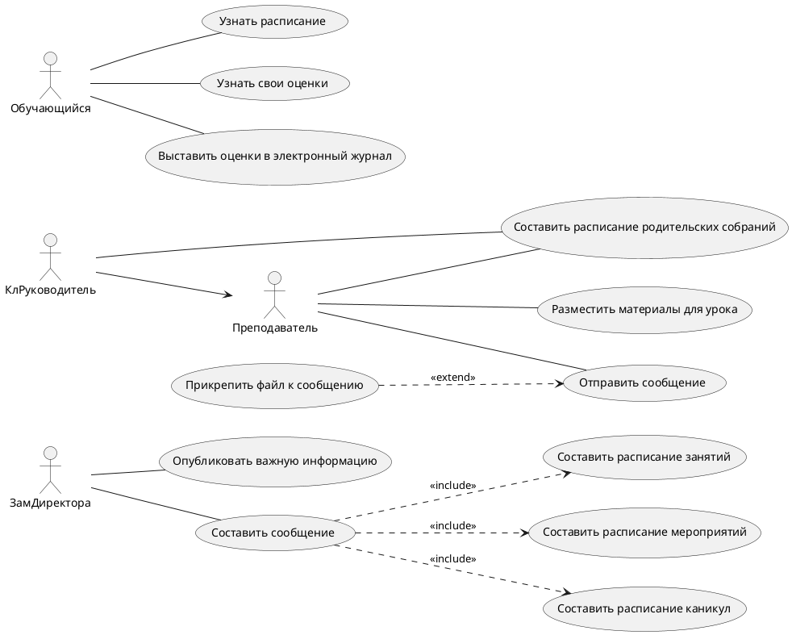
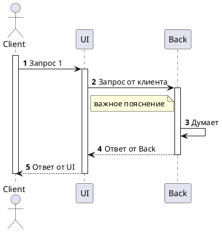

# Task

Task: Объекты, функции

# Use case

```plantuml
@startuml
left to right direction
skinparam packageStyle rectangle

actor ЗамДиректора
actor Преподаватель
actor КлРуководитель
actor Обучающийся

ЗамДиректора -- (Опубликовать важную информацию)
ЗамДиректора -- (Составить сообщение)

Обучающийся -- (Узнать расписание)
Обучающийся -- (Узнать свои оценки)
Обучающийся -- (Выставить оценки в электронный журнал)

Преподаватель -- (Разместить материалы для урока)
Преподаватель -- (Составить расписание родительских собраний)
Преподаватель -- (Отправить сообщение)

КлРуководитель -- (Составить расписание родительских собраний)
КлРуководитель --> Преподаватель

(Составить сообщение) ..> (Составить расписание занятий) : <<include>>
(Составить сообщение) ..> (Составить расписание мероприятий) : <<include>>
(Составить сообщение) ..> (Составить расписание каникул) : <<include>>

(Прикрепить файл к сообщению) ..> (Отправить сообщение) : <<extend>>

@enduml
```

# Sequential diagrams

```plantuml
@startuml test_name
    autonumber

    actor Client
  
    participant UI
    participant Back

    activate Client
      Client -> UI: Запрос 1

    activate UI
      UI -> Back: Запрос от клиента

    activate Back
  
      note right of UI: важное пояснение
    
      Back -> Back: Думает
      UI <-- Back: Ответ от Back

    deactivate Back
      Client <-- UI: Ответ от UI

    deactivate UI
    deactivate Client
@enduml
```

# Class diagram

# Use case for test

# Component diagram
