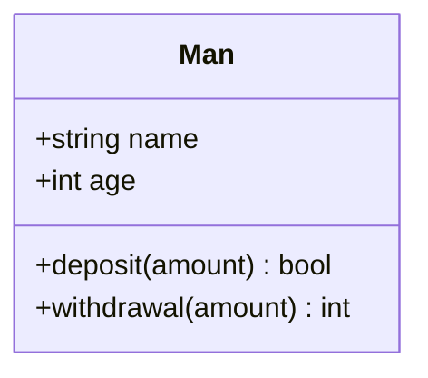

# Задание (что сделать, какие методы)

---

# Визуальное представление задания([диаграммы](https://mermaid.js.org/syntax/classDiagram.html))

# Формат входных данных (пример)

---

Ввод:

# Формат выходных данных (пример)

Вывод:

# Ограничения

---

Будет:
Не будет:

# Как будет тестироваться код ([бенчмарки](https://quick-bench.com/),память,логика)

---

# Вспомогательные вопросы

---

- Как
- Что
- Какой из
- Зачем
- Почему
- Сколько

# Теория КМНД
---

# Аналоги
Аналоги: 
